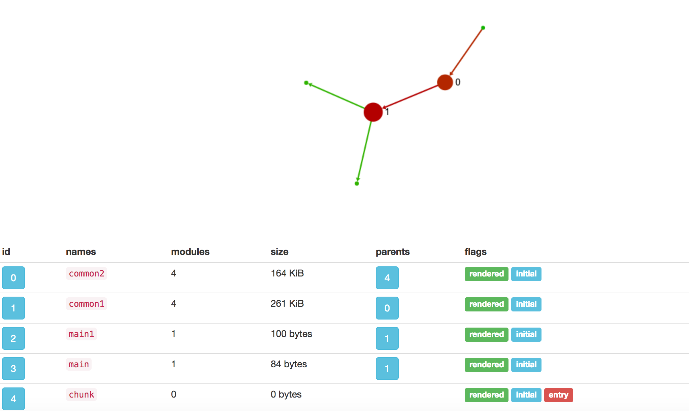
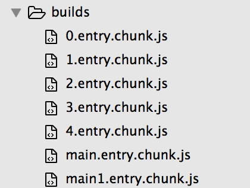
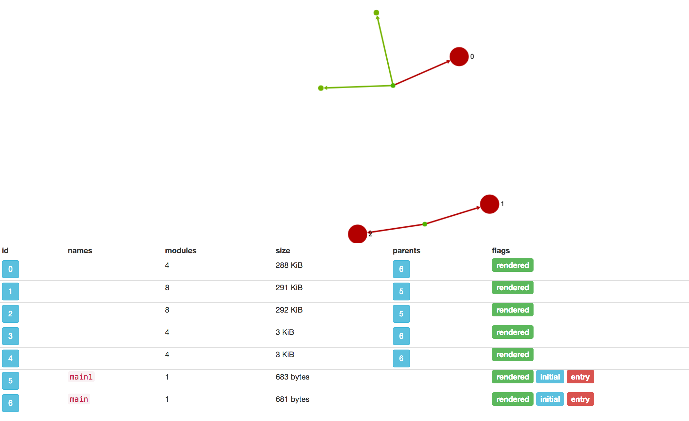
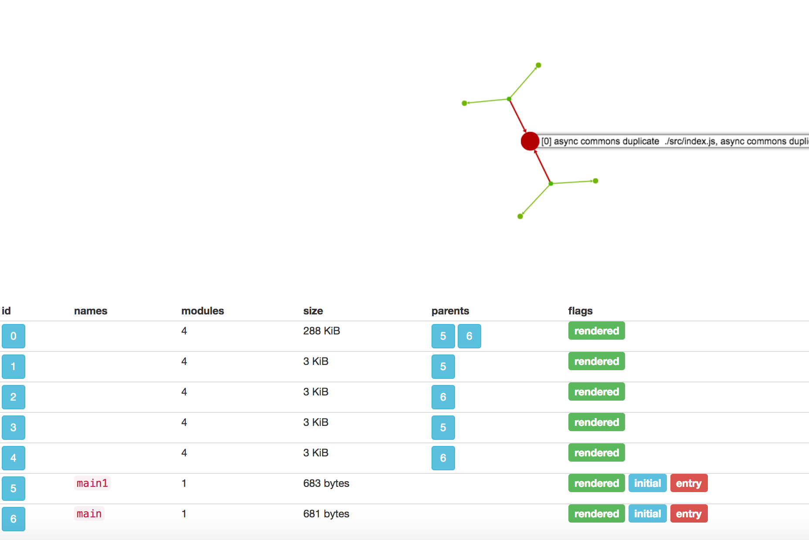

### 1.不添加commonchunkplugin打包的文件

我们的webpack配置如下：

```js
 var webpack = require('webpack');

module.exports = {
    entry:  {
         main:'./src/index.js',
         main1:'./src/index1.js'
    },
    output: {
        path:     'builds',
        filename: "[name].entry.chunk.js",
        publicPath: 'builds/',
    },
    plugins: [

    ],
    module: {
         loaders: [
         {
            test: /\.js$/,
             enforce: "pre",
             loader: "eslint-loader"
          },
           {
                test:    /\.js/,
                loader:  'babel-loader',
                include: __dirname + '/src',
            },
            {
                test:   /\.scss/,
                loader: 'style-loader!css-loader!sass-loader',
                // Or
               // loaders: ['style', 'css', 'sass'],
               //这里必须是loader后缀
            },
            {
                test:   /\.html/,
                loader: 'html-loader',
            }
        ],
    }
};
```

此时我们在build目录下生成如下的六个文件：


此时main和main1表示的都是入口文件打包的结果，而我们的其他文件都是通过require.ensure打包而成的。

### 2.添加commonchunkplugin打包的文件

更新webpack如下：

```js
var webpack = require('webpack');

module.exports = {
    entry:  {
         main:'./src/index.js',
         main1:'./src/index1.js'
    },
    output: {
        path:     'builds',
        // filename: '[chunkhash].output.js',
        filename: "[name].entry.chunk.js",
        publicPath: 'builds/',
    },
    plugins: [
         new webpack.optimize.CommonsChunkPlugin({
                // async: true,
                filename:'[name].bundle.js',
                children:true,
               //对main和main1的文件单独打包，main的chunks集合包含了两个文件，也就是require.ensure后的两个文件
                name:      ['main','main1'], // Move dependencies to our main file
                minChunks: 2, // How many times a dependency must come up before being extracted
            }),

    ],
    module: {
         loaders: [
         {
            test: /\.js$/,
             enforce: "pre",
             loader: "eslint-loader"
          },
           {
                test:    /\.js/,
                loader:  'babel-loader',
                include: __dirname + '/src',
            },
            {
                test:   /\.scss/,
                loader: 'style-loader!css-loader!sass-loader',
                // Or
               // loaders: ['style', 'css', 'sass'],
               //这里必须是loader后缀
            },
            {
                test:   /\.html/,
                loader: 'html-loader',
            }
        ],
    }
};
```

此时打包的结果为如下：


其中 name:['main','main1']的配置表示，我们的main和main1这两个chunk(entry中配置)对应的子chunk中公有的模块会被打包到一起，也就是打包到main.entry.chunk.js和main1.entry.chunk.js中，但是输出文件不再是main.entry.chunk.js和main1.entry.chunk.js，而是filename:'[name].bundle.js'，也就是最后生成的main.bundle.js和main1.bundle.js。

### 3.当配置children后我们抽取公共模块的chunks集合

这时候在插件commonChunkPlugin中的抽取公共chunk的代码:

```js
     commonChunks.forEach(function processCommonChunk(commonChunk, idx) {
                    let usedChunks;
                    if(Array.isArray(selectedChunks)) {
                        usedChunks = chunks.filter(chunk => chunk !== commonChunk && selectedChunks.indexOf(chunk.name) >= 0);
                    } else if(selectedChunks === false || asyncOption) {
                        usedChunks = (commonChunk.chunks || []).filter((chunk) => {
                            // we can only move modules from this chunk if the "commonChunk" is the only parent
                            return asyncOption || chunk.parents.length === 1;
                        });
                     
                     //(1)
                     var util = require('util'); 
                    console.log('------------->commonChunk',util.inspect(commonChunk, {showHidden:true,depth:4})); 
                    //如果name=［'main','main1'］那么表示以入口文件开始单独打包，此时的commonChunk就是我们的main.js和main1.js
                    //其chunks属性表示所有require.ensure的产生的chunk
                    } else {
                        if(commonChunk.parents.length > 0) {
                            compilation.errors.push(new Error("CommonsChunkPlugin: While running in normal mode it's not allowed to use a non-entry chunk (" + commonChunk.name + ")"));
                            return;
                        }
                        //如果found>=idx表示该chunk后续会作为一个独立的chunk来处理(独立打包)，所以此处不做修改
                        //这里的chunks集合是包括所有entry中配置的和在name数组中配置的，如果entry中不存在这个chunk而name中存在，直接创建一个空的chunk！
                        usedChunks = chunks.filter((chunk) => {
                            const found = commonChunks.indexOf(chunk);
                            if(found >= idx) return false;
                            return chunk.hasRuntime();
                        });
                    }
                    let asyncChunk;
                    if(asyncOption) {
                        asyncChunk = compilation.addChunk(typeof asyncOption === "string" ? asyncOption : undefined);
                        asyncChunk.chunkReason = "async commons chunk";
                        asyncChunk.extraAsync = true;
                        asyncChunk.addParent(commonChunk);
                        commonChunk.addChunk(asyncChunk);
                        commonChunk = asyncChunk;
                    }
                    const reallyUsedModules = [];
                    if(minChunks !== Infinity) {
                        const commonModulesCount = [];
                        const commonModules = [];
                        usedChunks.forEach((chunk) => {
                            chunk.modules.forEach((module) => {
                                const idx = commonModules.indexOf(module);
                                if(idx < 0) {
                                    commonModules.push(module);
                                    commonModulesCount.push(1);
                                } else {
                                    commonModulesCount[idx]++;
                                }
                            });
                        });
                        const _minChunks = (minChunks || Math.max(2, usedChunks.length));
                        commonModulesCount.forEach((count, idx) => {
                            const module = commonModules[idx];
                            if(typeof minChunks === "function") {
                                if(!minChunks(module, count))
                                    return;
                            } else if(count < _minChunks) {
                                return;
                            }
                            if(module.chunkCondition && !module.chunkCondition(commonChunk))
                                return;
                            reallyUsedModules.push(module);
                        });
                    }
                    if(minSize) {
                        const size = reallyUsedModules.reduce((a, b) => {
                            return a + b.size();
                        }, 0);
                        if(size < minSize)
                            return;
                    }
                    const reallyUsedChunks = new Set();
                    reallyUsedModules.forEach((module) => {
                        usedChunks.forEach((chunk) => {
                            if(module.removeChunk(chunk)) {
                                reallyUsedChunks.add(chunk);
                            }
                        });
                        commonChunk.addModule(module);
                        module.addChunk(commonChunk);
                    });
                    if(asyncOption) {
                        for(const chunk of reallyUsedChunks) {
                            if(chunk.isInitial()) continue;
                            chunk.blocks.forEach((block) => {
                                block.chunks.unshift(commonChunk);
                                commonChunk.addBlock(block);
                            });
                        }
                        asyncChunk.origins = Array.from(reallyUsedChunks).map((chunk) => {
                            return chunk.origins.map((origin) => {
                                const newOrigin = Object.create(origin);
                                newOrigin.reasons = (origin.reasons || []).slice();
                                newOrigin.reasons.push("async commons");
                                return newOrigin;
                            });
                        }).reduce((arr, a) => {
                            arr.push.apply(arr, a);
                            return arr;
                        }, []);
                    } else {
                        usedChunks.forEach((chunk) => {
                            chunk.parents = [commonChunk];
                            chunk.entrypoints.forEach((ep) => {
                                ep.insertChunk(commonChunk, chunk);
                            });
                            commonChunk.addChunk(chunk);
                        });
                    }
                    if(filenameTemplate)
                        commonChunk.filenameTemplate = filenameTemplate;
                });
```

我们看看其中的chunk.hasRuntime函数：

```js
hasRuntime() {
    if(this.entrypoints.length === 0) return false;
    return this.entrypoints[0].chunks[0] === this;
  }
```

我们看看chunk.entrypoints内部表示(见data.js下名字为main的chunk)：

```js
 entrypoints: 
   [ Entrypoint { name: 'main', chunks: [ [Circular], [length]: 1 ] },
     [length]: 1 ]
```

所以只有顶级chunk才会有执行环境。我们顺便看看在commonchunkplugin的处理方式：

```js
   //usedChunks是已经抽取了公共模块的chunk
   usedChunks.forEach(function(chunk) {
            chunk.parents = [commonChunk];
            chunk.entrypoints.forEach(function(ep) {
              ep.insertChunk(commonChunk, chunk);
              //在每一个移除了公共代码的chunk之前插入commonChunk
            });
            //每一个移除了公共chunk的chunk.entrypoints添加一个chunk
            commonChunk.addChunk(chunk);
          });
```

我们顺便也给出EntryPoint的代码：

```js
class Entrypoint {
  constructor(name) {
    this.name = name;
    this.chunks = [];
  }
  unshiftChunk(chunk) {
    this.chunks.unshift(chunk);
    chunk.entrypoints.push(this);
  }
  insertChunk(chunk, before) {
    const idx = this.chunks.indexOf(before);
    if(idx >= 0) {
      this.chunks.splice(idx, 0, chunk);
    } else {
      throw new Error("before chunk not found");
    }
    chunk.entrypoints.push(this);
  }
  getFiles() {
    let files = [];
    for(let chunkIdx = 0; chunkIdx < this.chunks.length; chunkIdx++) {
      for(let fileIdx = 0; fileIdx < this.chunks[chunkIdx].files.length; fileIdx++) {
        if(files.indexOf(this.chunks[chunkIdx].files[fileIdx]) === -1) {
          files.push(this.chunks[chunkIdx].files[fileIdx]);
        }
      }
    }

    return files;
  }
}
module.exports = Entrypoint;

```

我们把上面的那几句代码添加注释来看看具体的打印内容：

```js
   usedChunks.forEach(function(chunk,index) {
           var util = require('util'); 
               console.log('------------->before'+chunk.name,util.inspect(chunk.entrypoints, {showHidden:true,depth:2})); 
            chunk.parents = [commonChunk];
            chunk.entrypoints.forEach(function(ep) {
              ep.insertChunk(commonChunk, chunk);
            });
              var util = require('util'); 
          console.log('------------->end'+chunk.name,util.inspect(chunk.entrypoints, {showHidden:true,depth:2})); 
            commonChunk.addChunk(chunk);
          });
```

其中webpack中name的配置为 name: ["chunk",'common1','common2']。控制台打印结果可以[查看这里](./print.md)。

所以，每一个Entrypoint.chunks表示这个Entrypoint产生了多少个chunks!chunk.entrypoints表示该chunk来自于哪些Entrypoint！从而形成一个网状结构！

#### 3.1 commonChunkPlugin抽取之前的chunk

在(1)处，仅仅表示我们自己的main或者main1这个chunk的基本信息，包括modules等，还没有经过commonChunkPlugin进行抽取，具体内容参见data.js。

其中chunk的内部结构如下：

```js
Chunk {
  id: null,
  ids: null,
  debugId: 1000,
  name: 'main',
  //chunk对应的name
  modules: [],
  //该chunk来自于哪些module,main这个chunk来自于src/index.js,该module包含两个RequireEnsureDependenciesBlock
  entrypoints: 
   [ Entrypoint { name: 'main', chunks: [ [Circular], [length]: 1 ] },
     [length]: 1 ],
  //入口文件为main:'./src/index.js',而entryPoint对应的chunk为对当前chunk的循环引用
 chunks:[],//当前chunk的子级chunks有哪些，如require.ensure都是当前chunk的子级chunk
 parents: [ [length]: 0 ],
 //当前chunk的父级chunk集合，没有经过commonChunkPlugin处理main是顶级chunk
 blocks: [ [length]: 0 ],
 //module.blocks表示模块包含的块RequireEnsureDependenciesBlock等的个数，chunk.block表示当前chunk包含的block的个数
 origins: 
 //当前chunk从哪些模块得到
   [ { module: 
        NormalModule {
          dependencies: [ [Object], [length]: 1 ],
          blocks: [ [Object], [Object], [length]: 2 ],
          variables: [ [length]: 0 ],
          context: '/Users/klfang/Desktop/webpack-chunkfilename/src',
          reasons: [ [length]: 0 ],
          debugId: 1000,
          lastId: null,
          id: null,
          portableId: null,
          index: 0,
          index2: 12,
          depth: 0,
          used: true,
          usedExports: true,
          providedExports: true,
          chunks: [ [Circular], [length]: 1 ],
          warnings: [ [Object], [length]: 1 ],
          dependenciesWarnings: [ [length]: 0 ],
          errors: [ [length]: 0 ],
          dependenciesErrors: [ [length]: 0 ],
          strict: true,
          meta: {},
          request: '/Users/klfang/Desktop/webpack-chunkfilename/node_modules/babel-loader/lib/index.js!/Users/klfang/Desktop/webpack-chunkfilename/node_modules/eslint-loader/index.js!/Users/klfang/Desktop/webpack-chunkfilename/src/index.js',
          userRequest: '/Users/klfang/Desktop/webpack-chunkfilename/src/index.js',
          rawRequest: './src/index.js',
          parser: 
           Parser {
             _plugins: [Object],
             options: undefined,
             scope: undefined,
             state: undefined },
          resource: '/Users/klfang/Desktop/webpack-chunkfilename/src/index.js',
          loaders: [ [Object], [Object], [length]: 2 ],
          //module.fileDependencies: An array of source file paths included into a module. This includes the source JavaScript file itself (ex: index.js), and all dependency asset files (stylesheets, images, etc) that it has required. Reviewing dependencies is useful for seeing what source files belong to a module.
          //这个module没有引入相应的css/html/image等
          fileDependencies: 
           [ '/Users/klfang/Desktop/webpack-chunkfilename/src/index.js',
             [length]: 1 ],
          contextDependencies: [ [length]: 0 ],
          error: null,
          _source: 
           OriginalSource {
             _value: '\'use strict\';\n\n// var $ = require(\'jquery\');\n\n// $(\'body\').html(\'Hello\');\n\n\n// import $ from \'jquery\';\n// $(\'body\').html(\'Hello\');\n\n\n// import Button from \'./Components/Button\';\n// const button = new Button(\'google.com\');\n//  button.render(\'a\');\n\n//code splitting\nif (document.querySelectorAll(\'a\').length) {\n    require.ensure([], function () {\n        var Button = require(\'./Components/Button\').default;\n        var button = new Button(\'google.com\');\n        button.render(\'a\');\n    });\n}\n\nif (document.querySelectorAll(\'h1\').length) {\n    require.ensure([], function () {\n        var Header = require(\'./Components/Header\').default;\n        new Header().render(\'h1\');\n    });\n}',
             _name: '/Users/klfang/Desktop/webpack-chunkfilename/node_modules/babel-loader/lib/index.js!/Users/klfang/Desktop/webpack-chunkfilename/node_modules/eslint-loader/index.js!/Users/klfang/Desktop/webpack-chunkfilename/src/index.js' },
          assets: {},
          built: true,
          _cachedSource: null,
          issuer: null,
          building: undefined,
          buildTimestamp: 1487137260364,
          cacheable: true },
       loc: undefined,
       name: 'main' },
     [length]: 1 ],
  files: [ [length]: 0 ],
  // An array of output filenames generated by the chunk. 
  //You may access these asset sources from the compilation.assets table.
  //表示这个chunk产生的输出文件，此处为顶级chunk没有输出文件产生
  _removeAndDo:{},
  addChunk:{},
  addParent:{},
  //入口模块
  entryModule: 
   NormalModule {
     dependencies: 
      [ ConstDependency {},
        [length]: 1 ],
     blocks: 
      [ RequireEnsureDependenciesBlock {
          dependencies: [ [Object], [Object], [Object], [length]: 3 ],
          blocks: [ [length]: 0 ],
          variables: [ [length]: 0 ],
          chunkName: null,
          chunks: [ [Object], [length]: 1 ],
          module: [Circular],
          loc: SourceLocation { start: [Object], end: [Object] },
          expr: 
           Node {
             type: 'CallExpression',
             start: 313,
             end: 488,
             loc: [Object],
             range: [Object],
             callee: [Object],
             arguments: [Object] },
          range: [ 345, 486, [length]: 2 ],
          chunkNameRange: null,
          parent: [Circular] },
        RequireEnsureDependenciesBlock {
          dependencies: [ [Object], [Object], [Object], [length]: 3 ],
          blocks: [ [length]: 0 ],
          variables: [ [length]: 0 ],
          chunkName: null,
          chunks: [ [Object], [length]: 1 ],
          module: [Circular],
          loc: SourceLocation { start: [Object], end: [Object] },
          expr: 
           Node {
             type: 'CallExpression',
             start: 543,
             end: 678,
             loc: [Object],
             range: [Object],
             callee: [Object],
             arguments: [Object] },
          range: [ 575, 676, [length]: 2 ],
          chunkNameRange: null,
          parent: [Circular] },
        [length]: 2 ],
     variables: [ [length]: 0 ],
     context: '/Users/klfang/Desktop/webpack-chunkfilename/src',
     reasons: [ [length]: 0 ],
     debugId: 1000,
     lastId: null,
     id: null,
     portableId: null,
     index: 0,
     index2: 12,
     depth: 0,
     used: true,
     usedExports: true,
     providedExports: true,
     chunks: [ [Circular], [length]: 1 ],
     warnings: [],
     dependenciesWarnings: [ [length]: 0 ],
     errors: [ [length]: 0 ],
     dependenciesErrors: [ [length]: 0 ],
     strict: true,
     meta: {},
     request: '/Users/klfang/Desktop/webpack-chunkfilename/node_modules/babel-loader/lib/index.js!/Users/klfang/Desktop/webpack-chunkfilename/node_modules/eslint-loader/index.js!/Users/klfang/Desktop/webpack-chunkfilename/src/index.js',
     userRequest: '/Users/klfang/Desktop/webpack-chunkfilename/src/index.js',
     rawRequest: './src/index.js',
     parser: 
      Parser {
        _plugins: {},
        options: undefined,
        scope: undefined,
        state: undefined },
     resource: '/Users/klfang/Desktop/webpack-chunkfilename/src/index.js',
     loaders: 
      [ { loader: '/Users/klfang/Desktop/webpack-chunkfilename/node_modules/babel-loader/lib/index.js' },
        { loader: '/Users/klfang/Desktop/webpack-chunkfilename/node_modules/eslint-loader/index.js' },
        [length]: 2 ],
     fileDependencies: 
      [ '/Users/klfang/Desktop/webpack-chunkfilename/src/index.js',
        [length]: 1 ],
     contextDependencies: [ [length]: 0 ],
     error: null,
     _source: 
      OriginalSource {
        _value: '\'use strict\';\n\n// var $ = require(\'jquery\');\n\n// $(\'body\').html(\'Hello\');\n\n\n// import $ from \'jquery\';\n// $(\'body\').html(\'Hello\');\n\n\n// import Button from \'./Components/Button\';\n// const button = new Button(\'google.com\');\n//  button.render(\'a\');\n\n//code splitting\nif (document.querySelectorAll(\'a\').length) {\n    require.ensure([], function () {\n        var Button = require(\'./Components/Button\').default;\n        var button = new Button(\'google.com\');\n        button.render(\'a\');\n    });\n}\n\nif (document.querySelectorAll(\'h1\').length) {\n    require.ensure([], function () {\n        var Header = require(\'./Components/Header\').default;\n        new Header().render(\'h1\');\n    });\n}',
        _name: '/Users/klfang/Desktop/webpack-chunkfilename/node_modules/babel-loader/lib/index.js!/Users/klfang/Desktop/webpack-chunkfilename/node_modules/eslint-loader/index.js!/Users/klfang/Desktop/webpack-chunkfilename/src/index.js' },
     assets: {},
     built: true,
     _cachedSource: null,
     issuer: null,
     building: undefined,
     buildTimestamp: 1487137260364,
     cacheable: true } }
}
```

#### 3.2 commonChunkPlugin抽取公共代码抽取可视化分析

运行[commonsChunkPlugin_Config](https://github.com/liangklfangl/commonsChunkPlugin_Config/tree/master/example3)中的example3代码,其中webpack的配置如下：

```js
 var CommonsChunkPlugin = require("webpack/lib/optimize/CommonsChunkPlugin");
 module.exports = {
     entry: {
         main: process.cwd()+'/example3/main.js',
         main1: process.cwd()+'/example3/main1.js',
         common1:["jquery"],
         common2:["vue"]
     },
     output: {
         path: process.cwd()+'/dest/example3',
         filename: '[name].js'
    },
     plugins: [
         new CommonsChunkPlugin({
             name: ["chunk",'common1','common2'],
             minChunks:2
         })
     ]
 };
```

我们看看commonchunkplugin中的处理方式(else部分)：

```js
    if(Array.isArray(selectedChunks)) {
          usedChunks = chunks.filter(function(chunk) {
            if(chunk === commonChunk) return false;
            //此时commonChunk的内容是已经存在于最终的文件中了，如果它不是手动创建的chunk
            //去掉下例的jquery,得到usedChunks集合
            return selectedChunks.indexOf(chunk.name) >= 0;
          });
        } else if(selectedChunks === false || asyncOption) {
          usedChunks = (commonChunk.chunks || []).filter(function(chunk) {
            // we can only move modules from this chunk if the "commonChunk" is the only parent
            //只是把一级子chunk的公共内容提取出来，如果有一个子chunk的父级chunk有两个那么不会被提取出来。
            return asyncOption || chunk.parents.length === 1;
          });
        } else {
          //如果当前的这个chunk有多个父级chunk，那么不会提取的
          if(commonChunk.parents.length > 0) {
            compilation.errors.push(new Error("CommonsChunkPlugin: While running in normal mode it's not allowed to use a non-entry chunk (" + commonChunk.name + ")"));
            return;
          }
          usedChunks = chunks.filter(function(chunk) {
            var found = commonChunks.indexOf(chunk);
            if(found >= idx) return false;
            return chunk.hasRuntime();
          });
        }
```

如果你运行如下命令webpack --profile --json > stats.json并按照[本文](https://github.com/liangklfangl/webpack-chunkfilename)方式查看，你会发现其实可视化后各个chunk的关系是如下所示的：


这样就很容易知道commonchunkplugin的处理方式了吧。

其中有一点你要特别注意，就是如果吧webpack配置修改为如下:

```js
   new CommonsChunkPlugin({
             name: ["common1",'common2','chunk'],
             minChunks:2
         })
```

此时我们继续可视化会得到如下的结果：



所以通过修改name数组中的元素的顺序往往会得到不同的chunk关系！但是需要注意一点，那就是我们的runtime执行环境会被抽取到最上级的chunk中，这里就是chunk.js：

```js
/******/ (function(modules) { // webpackBootstrap
/******/  // install a JSONP callback for chunk loading
/******/  var parentJsonpFunction = window["webpackJsonp"];
/******/  window["webpackJsonp"] = function webpackJsonpCallback(chunkIds, moreModules, executeModules) {
/******/    // add "moreModules" to the modules object,
/******/    // then flag all "chunkIds" as loaded and fire callback
/******/    var moduleId, chunkId, i = 0, resolves = [], result;
/******/    for(;i < chunkIds.length; i++) {
/******/      chunkId = chunkIds[i];
/******/      if(installedChunks[chunkId])
/******/        resolves.push(installedChunks[chunkId][0]);
/******/      installedChunks[chunkId] = 0;
/******/    }
/******/    for(moduleId in moreModules) {
/******/      if(Object.prototype.hasOwnProperty.call(moreModules, moduleId)) {
/******/        modules[moduleId] = moreModules[moduleId];
/******/      }
/******/    }
/******/    if(parentJsonpFunction) parentJsonpFunction(chunkIds, moreModules, executeModules);
/******/    while(resolves.length)
/******/      resolves.shift()();
/******/    if(executeModules) {
/******/      for(i=0; i < executeModules.length; i++) {
/******/        result = __webpack_require__(__webpack_require__.s = executeModules[i]);
/******/      }
/******/    }
/******/    return result;
/******/  };

/******/  // The module cache
/******/  var installedModules = {};

/******/  // objects to store loaded and loading chunks
/******/  var installedChunks = {
/******/    4: 0
/******/  };

/******/  // The require function
/******/  function __webpack_require__(moduleId) {

/******/    // Check if module is in cache
/******/    if(installedModules[moduleId])
/******/      return installedModules[moduleId].exports;

/******/    // Create a new module (and put it into the cache)
/******/    var module = installedModules[moduleId] = {
/******/      i: moduleId,
/******/      l: false,
/******/      exports: {}
/******/    };

/******/    // Execute the module function
/******/    modules[moduleId].call(module.exports, module, module.exports, __webpack_require__);

/******/    // Flag the module as loaded
/******/    module.l = true;

/******/    // Return the exports of the module
/******/    return module.exports;
/******/  }

/******/  // This file contains only the entry chunk.
/******/  // The chunk loading function for additional chunks
/******/  __webpack_require__.e = function requireEnsure(chunkId) {
/******/    if(installedChunks[chunkId] === 0)
/******/      return Promise.resolve();

/******/    // an Promise means "currently loading".
/******/    if(installedChunks[chunkId]) {
/******/      return installedChunks[chunkId][2];
/******/    }
/******/    // start chunk loading
/******/    var head = document.getElementsByTagName('head')[0];
/******/    var script = document.createElement('script');
/******/    script.type = 'text/javascript';
/******/    script.charset = 'utf-8';
/******/    script.async = true;
/******/    script.timeout = 120000;

/******/    if (__webpack_require__.nc) {
/******/      script.setAttribute("nonce", __webpack_require__.nc);
/******/    }
/******/    script.src = __webpack_require__.p + "" + chunkId + ".js";
/******/    var timeout = setTimeout(onScriptComplete, 120000);
/******/    script.onerror = script.onload = onScriptComplete;
/******/    function onScriptComplete() {
/******/      // avoid mem leaks in IE.
/******/      script.onerror = script.onload = null;
/******/      clearTimeout(timeout);
/******/      var chunk = installedChunks[chunkId];
/******/      if(chunk !== 0) {
/******/        if(chunk) chunk[1](new Error('Loading chunk ' + chunkId + ' failed.'));
/******/        installedChunks[chunkId] = undefined;
/******/      }
/******/    };

/******/    var promise = new Promise(function(resolve, reject) {
/******/      installedChunks[chunkId] = [resolve, reject];
/******/    });
/******/    installedChunks[chunkId][2] = promise;

/******/    head.appendChild(script);
/******/    return promise;
/******/  };

/******/  // expose the modules object (__webpack_modules__)
/******/  __webpack_require__.m = modules;

/******/  // expose the module cache
/******/  __webpack_require__.c = installedModules;

/******/  // identity function for calling harmony imports with the correct context
/******/  __webpack_require__.i = function(value) { return value; };

/******/  // define getter function for harmony exports
/******/  __webpack_require__.d = function(exports, name, getter) {
/******/    if(!__webpack_require__.o(exports, name)) {
/******/      Object.defineProperty(exports, name, {
/******/        configurable: false,
/******/        enumerable: true,
/******/        get: getter
/******/      });
/******/    }
/******/  };

/******/  // getDefaultExport function for compatibility with non-harmony modules
/******/  __webpack_require__.n = function(module) {
/******/    var getter = module && module.__esModule ?
/******/      function getDefault() { return module['default']; } :
/******/      function getModuleExports() { return module; };
/******/    __webpack_require__.d(getter, 'a', getter);
/******/    return getter;
/******/
  };

/******/  // Object.prototype.hasOwnProperty.call
/******/  __webpack_require__.o = function(object, property) { return Object.prototype.hasOwnProperty.call(object, property); };

/******/  // __webpack_public_path__
/******/  __webpack_require__.p = "";

/******/  // on error function for async loading
/******/  __webpack_require__.oe = function(err) { console.error(err); throw err; };
/******/ })
/************************************************************************/
/******/ ([]);
```

当然，我们也可以运行当前目录下的例子，修改webpack配置为：

```js
 new webpack.optimize.CommonsChunkPlugin({
                filename:'[name].bundle.js',
                name:      ['main','main1'], // Move dependencies to our main file
                minChunks: 2, // How many times a dependency must come up before being extracted
            }),
```

此时可视化后的结果将是如下：


注意看initial和entry,比如我们的main1,main都是initital，但是只有main1是entry类型(虽然按照上面的分析，这里的name集合和entry配置的都是完全一样，因为entry也是main和main1，但是你会发现我们的main1和main还是要通过commonchunkplugin进行一次抽取，所以导致最后的runtime部分被抽取的到main1.bundle.js中，这也是为什么我们要先加载main1.bundle.js的原因);而且，通过这个可视化结果的parents部分你也能清晰的看到每一个chunk之间的父子关系。注意：如果无法打开stats.json可以打开该文件看看是否有你自己打印的console.log内容。


### 4.当配置async的时候处理

#### 4.1 首先我们修改webpack配置为不含有aync的配置：

```js
    new webpack.optimize.CommonsChunkPlugin({
            name:      'main', // Move dependencies to our main file
            minChunks: 2, // How many times a dependency must come up before being extracted
        }),
```

我们可视化后会得到如下的chunk关系图：


通过上面的分析是清理之中的，最后会导致main1中的公共代码抽取到main这个chunk中，包括runtime，所以main这个chunk必须要提前加载。

#### 4.2 我们修改webpack配置为含有aync的配置：

webpack配置为：

```js
   new webpack.optimize.CommonsChunkPlugin({
            async: true,
            name:      'main', // Move dependencies to our main file
            minChunks: 2, // How many times a dependency must come up before being extracted
        }),
```

首先文件的输出为：



也就是说，这种添加async配置后的chunk输出要比没有添加async多了一个文件。我们来查看一下可视化的结果：



通过上图，我们其是是添加了一个新的chunk，该chunk是CommonsChunkPlugin的name指定的这个chunk的子级chunk！

我们继续修改webpack的配置如下：

```js
 new webpack.optimize.CommonsChunkPlugin({
            async: true,
            name:     ['main','main1'], // Move dependencies to our main file
            minChunks: 2, // How many times a dependency must come up before being extracted
        }),
```

此时你会发现可视化结果如下：



也就是对于name指定的这个数组中每一个common chunk都会添加一个公有的子级chunk!

注意：上面的两种情况下,main和main1这两个chunk都是initial，也是entry chunk，此时commonChunkPlugin不再是抽取两个chunk的公有代码，而是创建一个新的子级chunk，该子级chunk和其他的子级chunk同时加载！

#### 4.3 我们看看commonChunkPlugin中内部的处理

首先是选择commonChunks集合：

```js
chunkNames = options.name || options.names;
selectedChunks = options.chunks;
if(options.children) selectedChunks = false;
//如果你没有指定chunk名称，同时指定了children，那么表示抽取所有的chunk中满足使用次数的chunk
if(!chunkNames && (selectedChunks === false || asyncOption)) {
          commonChunks = chunks;
    }
```

如果你没指定commonChunkplugin中的name，也就是公共chunk的名称（上面的例子表明name的指定用于表示为那个父级chunk添加一个子级asyncChunk）,那么为所有的chunks都添加这个asyncChunk。

下面是选择抽取哪些chunk，用来获取其中的公有的模块：

```js
     //用于code splitting的情况下获取commonChunk.chunks的子级chunk
     else if(selectedChunks === false || asyncOption) {
            usedChunks = (commonChunk.chunks || []).filter((chunk) => {
              // we can only move modules from this chunk if the "commonChunk" is the only parent
              return asyncOption || chunk.parents.length === 1;
            });
        }
```

如果配置了异步，那么还是对单个入口文件的子级chunk进行遍历，获取当前这个common chunk的所有的子级chunk，如main.js中所有通过require.ensure产生的子级chunk,得到的结果表示该common chunk使用的所有的usedChunks。

下面开始创建我们的asyncchunk:

```js
   let asyncChunk;
          if(asyncOption) {
            asyncChunk = compilation.addChunk(typeof asyncOption === "string" ? asyncOption : undefined);
            asyncChunk.chunkReason = "async commons chunk";
            asyncChunk.extraAsync = true;
            asyncChunk.addParent(commonChunk);
            commonChunk.addChunk(asyncChunk);
            commonChunk = asyncChunk;
            //每次循环common chunk都更新commonChunk为新创建的asyncChunk
          }
```

每次遍历一个commonChunk都是会新创建一个全新的asyncChunk，然后这个asyncChunk作为commonChunk的子级chunk。

接着抽取usedChunks，usedChunks指的是该main.js通过require.ensure产生的所有的子级chunk集合：

```js
if(minChunks !== Infinity) {
            const commonModulesCount = [];
            const commonModules = [];
            usedChunks.forEach((chunk) => {
              chunk.modules.forEach((module) => {
                const idx = commonModules.indexOf(module);
                if(idx < 0) {
                  commonModules.push(module);
                  commonModulesCount.push(1);
                } else {
                  commonModulesCount[idx]++;
                }
              });
            });
            const _minChunks = (minChunks || Math.max(2, usedChunks.length));
            commonModulesCount.forEach((count, idx) => {
              const module = commonModules[idx];
              if(typeof minChunks === "function") {
                if(!minChunks(module, count))
                  return;
              } else if(count < _minChunks) {
                return;
              }
              if(module.chunkCondition && !module.chunkCondition(commonChunk))
                return;
              reallyUsedModules.push(module);
            });
          }
```

将usedChunk中的公共模块移除(例如require.ensure),得到的结果放在reallyUsedChunks中。同时将公共的module添加到commonChunk中。

```js
const reallyUsedChunks = new Set();
          reallyUsedModules.forEach((module) => {
            usedChunks.forEach((chunk) => {
              if(module.removeChunk(chunk)) {
                reallyUsedChunks.add(chunk);
                //该chunk已经移除了公共的module了
              }
            });
            commonChunk.addModule(module);
            module.addChunk(commonChunk);
            //互相引用
          });
```


```js
   if(asyncOption) {
            for(const chunk of reallyUsedChunks) {
              //抽取了公共模块得到的chunk进行遍历
              if(chunk.isInitial()) continue;
              //require.ensure产生的不是initial chunk
              chunk.blocks.forEach((block) => {
                block.chunks.unshift(commonChunk);
                //block.chunks集合中存放的是我们要加载的chunk
                commonChunk.addBlock(block);
                //这个commonChunk也含有我们抽取掉了公共模块的哪些chunk的block
              });
            }
            asyncChunk.origins = Array.from(reallyUsedChunks).map((chunk) => {
              return chunk.origins.map((origin) => {
                //更新reasons
                const newOrigin = Object.create(origin);
                newOrigin.reasons = (origin.reasons || []).slice();
                newOrigin.reasons.push("async commons");
                return newOrigin;
              });
            }).reduce((arr, a) => {
              arr.push.apply(arr, a);
              return arr;
            }, []);
          } 
```


#### 4.4 commonChunkPlugin牵涉到的其他内容


##### 4.4.1 判断一个chunk是否是initial chunk:

```js
isInitial() {
    return this.entrypoints.length > 0;
  }
```

因为webpack会把require.ensure内容进行单独打包，所以对于它来说是不存在我们的entrypoints的，所以其不是initial chunk，但是包含require.ensure的main却是我们的intial chunk!而且commonchunkplugin是可以产生initial chunk的,因为common chunk会被添加entrypoint：

```js
    usedChunks.forEach((chunk) => {
              chunk.parents = [commonChunk];
              //common chunk会变成initial chunk，因为common chunk会添加entrypoint
              chunk.entrypoints.forEach((ep) => {
                ep.insertChunk(commonChunk, chunk);
              });
              commonChunk.addChunk(chunk);
            });
```


##### 4.4.2 判断一个chunk是否具有runtime

```js
 hasRuntime() {
    if(this.entrypoints.length === 0) return false;
    //必须是initial chunk，commonchunkplugin会抽取出来entrypoint（上面例子）
    return this.entrypoints[0].chunks[0] === this;
    //如果main这个chunk已经被commonchunkplugin处理后，那么chunks[0]是common chunk了
  }
```

情况1:如果我们没有加入commonchunkplugin，那么很显然我们的main和main1两个都是有runtime的，因为chunk.entrypoints表示该chunk来自于哪些入口点，而main这个chunk只有一个入口点。而entrypoint.chunks表示该入口文件产生了哪些chunks，那么很显然第一个chunk就是当前chunk本身！

情况2:如果加入commonchunkplugin，那么含有runtime的必须是最高级的common chunk。设想只有main,main1,common的情况，其中main,main1的公共代码抽取到common中,此时对于common来说，其entrypoints[0]就是main这个入口，而这个入口产生的第一个chunk就是common这个chunk(因为我们的commonchunkplugin采用的是把commonchunk插入到当前chunk之前)

```js
      usedChunks.forEach((chunk) => {
              chunk.parents = [commonChunk];
              chunk.entrypoints.forEach((ep) => {
                ep.insertChunk(commonChunk, chunk);
                //在chunks集合中common chunk在chunk之前
              });
              commonChunk.addChunk(chunk);
            });
```

注意：我们的require.ensure产生的chunk不是initial chunk(不含有entrypoint)，同时也是不含有runtime的！


